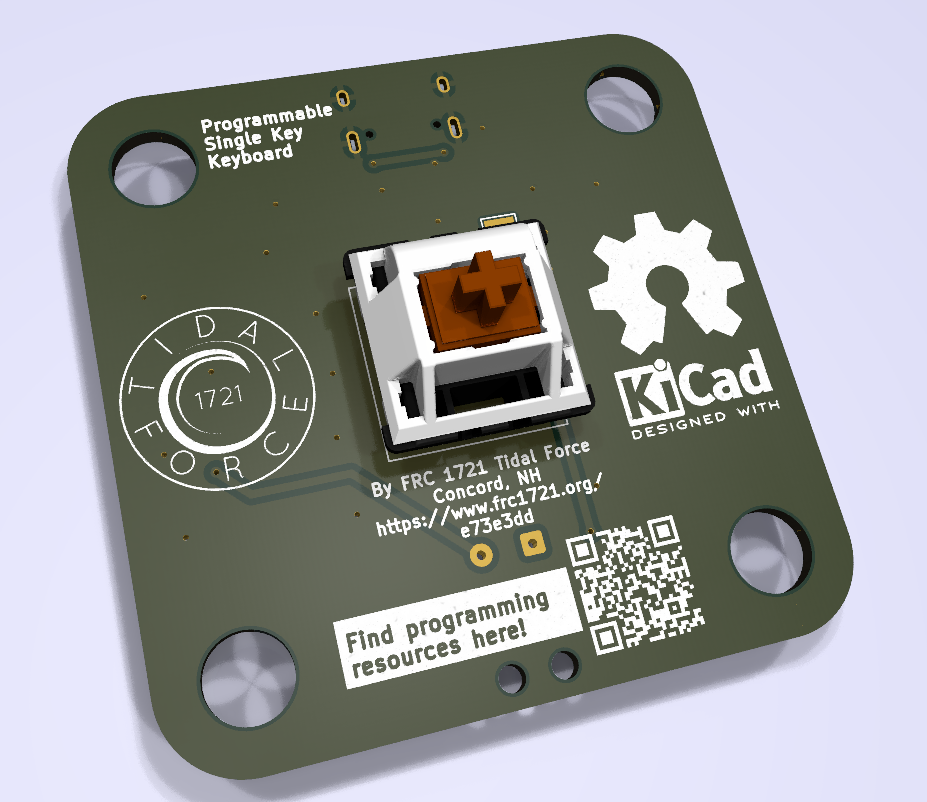

[](https://github.com/FRC-1721/SuperButton/actions/workflows/hardware_workflow.yml)
[](https://github.com/FRC-1721/SuperButton/actions/workflows/hardware_workflow.yml)



# Welcome!

# Getting Started!

Clone the repo with submodules!

```shell
git clone --recurse-submodules https://github.com/FRC-1721/SuperButton.git
```


## Init Submodules

Some libraries and resources are included as submodules, run the following
command to initialize them before opening the main sch

(If you get a missing library error, make sure to do this)

```shell
git submodule update --init --recursive
```
